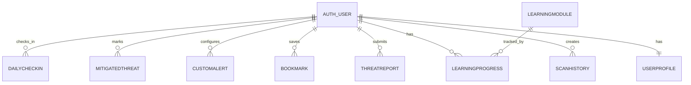

# Database Schema

Database engine: SQLite (`backend/db.sqlite3`)

Apps contributing tables:

- `api` app: operational/auth/learning/admin data.
- `content` app: site content, pricing, and threat intelligence catalog.

## 1) ERD (High-Level)

## 2) API App Tables (`backend/api/models.py`)

### `UserProfile`

Purpose: extended account state, limits, gamification.

Key fields:
- `user` (OneToOne -> auth user)
- `avatar` (Text)
- `role` (`admin|user`)
- `tier` (`free|pro|enterprise`)
- `status` (`active|inactive|suspended`)
- `scans_used`, `scans_limit`
- `api_calls_used`, `api_calls_limit`
- `alerts_used`, `alerts_limit`
- `renewal_date`
- `points`, `streak`
- `last_activity`, `created_at`, `updated_at`

Business rules:
- Auto-created via post-save signal on user creation.
- `apply_tier_limits()` normalizes limits by tier.

### `DailyCheckIn`

Purpose: daily rewards and streak behavior.

Key fields:
- `user` (FK)
- `date`
- `points_earned`
- `created_at`

Constraints:
- `unique_together (user, date)`.

### `ScanHistory`

Purpose: immutable scan event storage.

Key fields:
- `user` (FK)
- `type` (`email|url|file|qr`)
- `content` (raw submitted content)
- `threat_level` (`safe|low|medium|high|critical`)
- `score` (int)
- `details` (JSON)
- `created_at`

### `ThreatReport`

Purpose: user/community moderation queue.

Key fields:
- `user` (FK)
- `title`, `description`
- `threat_type`, `risk_level`
- `evidence` (Text; may contain serialized JSON)
- `status` (`pending|approved|rejected|investigating|resolved`)
- `created_at`

### `LearningModule`

Purpose: challenge catalog (quiz/simulation/assessment).

Key fields:
- `title`, `description`
- `type` (`Quiz|Simulation|Assessment`)
- `difficulty` (`Beginner|Intermediate|Advanced|Expert`)
- `duration`, `points`, `icon`
- `content_data` (JSON payload)

### `LearningProgress`

Purpose: per-user progress and completion score.

Key fields:
- `user` (FK)
- `module` (FK -> LearningModule)
- `completed` (bool)
- `score` (int)
- `completed_at`

Constraints:
- `unique_together (user, module)`.

### `Bookmark`

Purpose: user saved threat references.

Key fields:
- `user` (FK)
- `threat_id`, `threat_title`
- `threat_type`, `threat_severity`
- `created_at`

Constraints:
- `unique_together (user, threat_id)`.

### `MitigatedThreat`

Purpose: user-marked handled threats.

Key fields:
- `user` (FK)
- `threat_id`, `threat_title`
- `threat_type`, `threat_severity`
- `notes`
- `created_at`

Constraints:
- `unique_together (user, threat_id)`.

### `CustomAlert`

Purpose: user-defined alert conditions.

Key fields:
- `user` (FK)
- `title`, `keyword`
- `threat_type`, `min_severity`
- `active`
- `created_at`

### `SystemLog`

Purpose: operational/admin observable events.

Key fields:
- `level` (`INFO|WARN|ERROR`)
- `message`
- `created_at`

### `OTPCode`

Purpose: registration/password reset OTP lifecycle.

Key fields:
- `email`
- `code` (6 digits)
- `purpose` (`registration|password_reset`)
- `pending_data` (JSON)
- `is_used`
- `created_at`, `expires_at`

Index:
- `(email, purpose, is_used)`.

## 3) Content App Tables (`backend/content/models.py`)

### `LiveStat`
- `title`, `value`

### `TrustSignal`
- `type`, `name`, `description`, `logo`, `alt`

### `Feature`
- `icon`, `title`, `description`, `link`, `color`, `order`

### `ThreatReportSummary`
- `title`, `category`, `severity`, `date`, `description`, `affected_users`, `threat_link`

### `Testimonial`
- `name`, `role`, `company`, `image`, `alt`, `quote`, `rating`

### `LearningModuleHighlight`
- `title`, `description`, `duration`, `level`, `image`, `alt`, `completions`, `rating`, `link`

### `ThreatIntelligence`

Purpose: curated threat catalog records shown in Threat Intelligence DB UI.

Key fields:
- `threat_id` (unique business key)
- `title`, `type`, `severity`, `detected_date`
- `affected_users`
- `description`, `detailed_analysis`
- `image`, `alt`
- `origin`, `status`
- `community_reports`
- `prevention_tips` (JSON list)
- `real_world_examples` (JSON list)
- `related_threats` (JSON list)
- `community_insights` (JSON list)

### `PricingPlan`
- `plan_id` (unique), `name`, `description`
- `monthly_price`, `annual_price`
- badge and CTA presentation fields
- icon presentation fields
- `order`

### `PricingFeature`
- `name`, `category`
- `free_value`, `pro_value`, `enterprise_value`
- `order`

## 4) Data Lifecycle Notes

- User creation triggers profile creation with default tier/role logic.
- Threat report submission can automatically create a `ThreatIntelligence` entry if enough fields are provided.
- Learning completion updates progress records and contributes to dashboard metrics.
